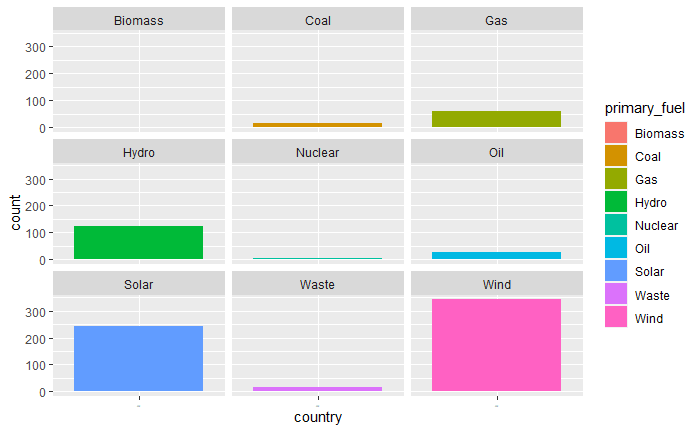

```{r setup, include=FALSE}
knitr::opts_chunk$set(echo = TRUE, warning = FALSE, message = FALSE)
library("tidyverse")
library("leaflet")
```

## Cosa si vedrà
* Qual è il tipo più comune di centrale elettrica in europa?
* Quali e quanti tipi di centrali elettriche ci sono in ogni nazione?
* Dove si trovano le centrali elettriche?
* Come si divide la produzione di elettricità?
* Come è variato il consumo di energia nel tempo?

## Qual è il tipo più comune di centrale elettrica in europa?


## Come mai il numero di centrali elettriche solari, eoliche e idroelettriche è cosi alto?

---


## Dove si trovano le centrali elettriche?

---

```{r echo=FALSE}

library("countrycode")

global_powerPlants <- read.csv("archive/global_power_plant_database_last.csv")

global_powerPlants <-
global_powerPlants %>%
  add_column(continent = NA, .after = 2)%>%
  select(country, country_long, continent, name, gppd_idnr, capacity_mw, latitude,longitude, primary_fuel, other_fuel1, other_fuel2, other_fuel3)

global_powerPlants$continent <- countrycode(sourcevar = global_powerPlants[['country_long']], origin = 'country.name', destination = 'continent')

europe_powerPlants <-
global_powerPlants%>%
  filter(continent == "Europe")

dataFrame <- europe_powerPlants %>%
  select(name,latitude,longitude,primary_fuel)

fuel_palette <- colorFactor(c("#FF3333","#FF6633","#CC9933","#999933","#339900","#339966","#33CCCC","#0099CC","#0099FF","#6666FF","#9933CC","#CC33CC","#FF66CC"), domain = dataFrame$primary_fuel)
leaflet() %>%
  setView(6.93, 48.46, zoom = 5)%>%
  addTiles()%>%
  addCircleMarkers(data = dataFrame, lat = ~latitude, lng = ~longitude, popup = ~name, color = ~fuel_palette(dataFrame$primary_fuel), radius = 5, fillOpacity = 0.3)%>%
  addLegend("bottomright", pal = fuel_palette, values = dataFrame$primary_fuel, opacity = 1)
```

## Come si divide la produzione di elettricità?

## Le nazioni scelte

1. Italia
2. Spagna
3. Francia
4. Germania
5. Regno Unito

## **Italia**


---


## **Spagna**



---


## **Francia**


---


## **Germania**


---


## **Regno Unito**


---


## Come è variato il consumo di energia nel tempo?

## **Italia**


## **Spagna**


## **Francia**


## **Germania**


## **Regno Unito**

